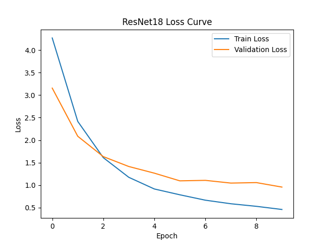
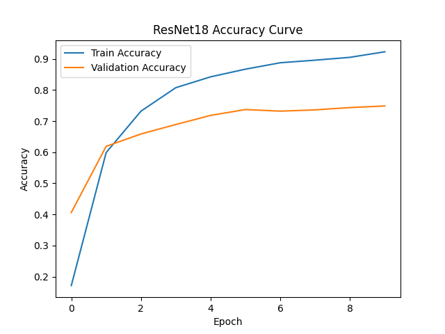
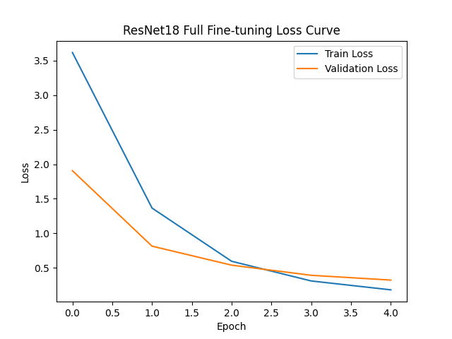
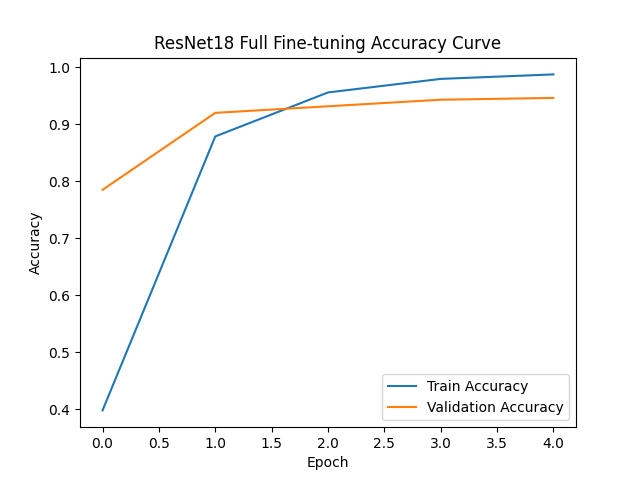
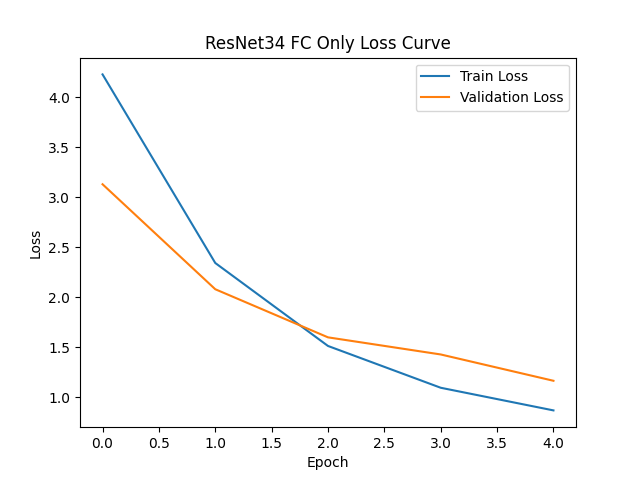
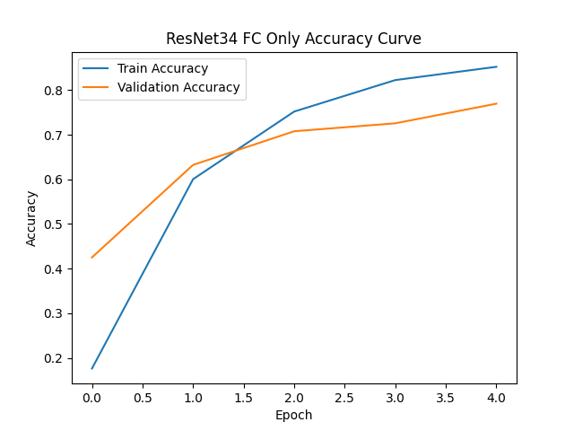
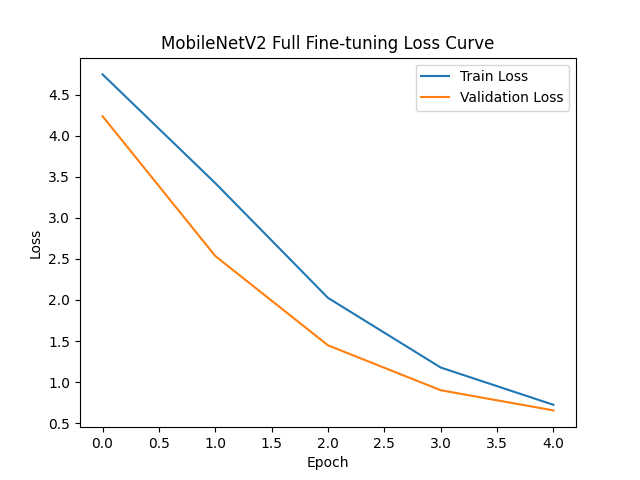
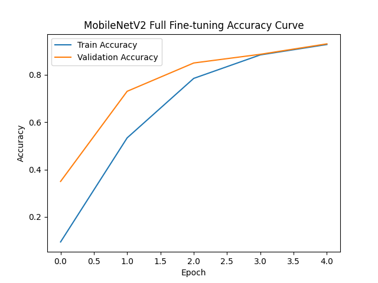
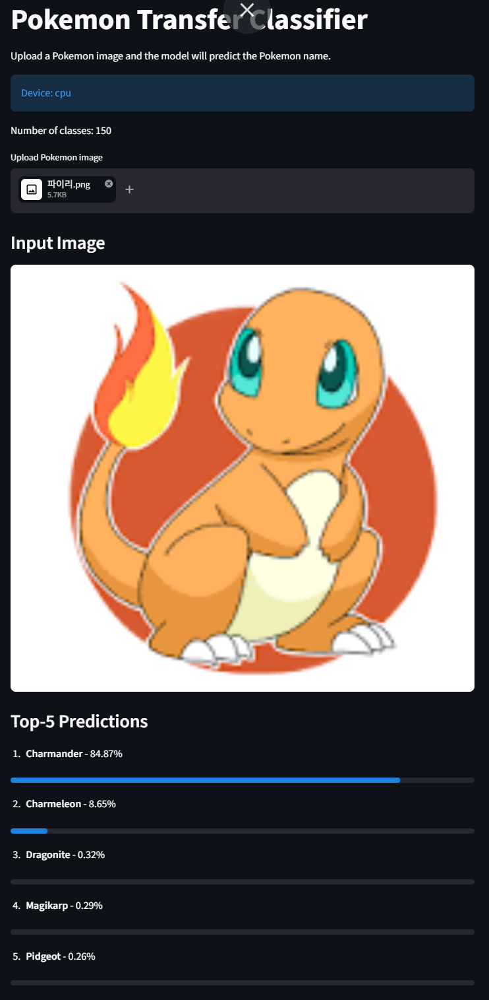

# 포켓몬 이미지 분류기

## 프로젝트 소개

이 프로젝트는 포켓몬 이미지를 입력하면 해당 이미지가 어떤 포켓몬인지 예측하는 이미지 분류 프로그램이다.

이미지 분류 모델을 처음부터 새로 학습시키는 대신, 이미 대규모 이미지 데이터로 학습된 모델을 가져와 포켓몬 이미지 데이터셋에 맞게 다시 학습시키는 방식으로 진행했다. 이를 통해 비교적 적은 데이터로도 안정적인 분류 성능을 얻는 것을 목표로 했다.

최종적으로 여러 모델과 학습 방식을 비교한 뒤, 가장 성능이 좋았던 모델을 이용해 이미지를 직접 업로드하고 예측 결과를 확인할 수 있는 데모 화면을 구현했다.

## 사용 데이터셋

본 프로젝트에서는 포켓몬 이미지 데이터셋을 사용했다.

데이터셋은 포켓몬 이름별 폴더로 구성되어 있으며, 각 폴더명이 정답 라벨로 사용된다. 전체 클래스 수는 150개이다.

데이터셋 원본 구조는 다음과 같다.

```text
PokemonData/
├── Abra/
├── Aerodactyl/
├── Alakazam/
├── Alolan Sandslash/
├── Arbok/
└── ...
```

학습을 위해 데이터셋을 학습 데이터, 검증 데이터, 테스트 데이터로 나누었다.

```text
data/pokemon/
├── train/
├── val/
└── test/
```

데이터셋은 용량이 크기 때문에 저장소에는 포함하지 않았다.

실행하려면 `PokemonData` 폴더를 프로젝트 최상단에 둔 뒤, 아래 명령어로 데이터를 분리하면 된다.

```bash
python src/split_dataset.py
```

## 프로젝트 구조

```text
pokemon-transfer-classifier/
├── app.py
├── README.md
├── requirements.txt
├── src/
│   ├── split_dataset.py
│   ├── train_resnet18.py
│   ├── train_resnet18_full.py
│   ├── train_resnet34_fc_only.py
│   ├── train_mobilenetv2_full.py
│   └── predict.py
├── models/
│   └── class_names.json
└── results/
    ├── resnet18_loss_curve.png
    ├── resnet18_accuracy_curve.png
    ├── resnet18_full_loss_curve.png
    ├── resnet18_full_accuracy_curve.png
    ├── resnet34_fc_only_loss_curve.png
    ├── resnet34_fc_only_accuracy_curve.png
    ├── mobilenetv2_full_loss_curve.png
    └── mobilenetv2_full_accuracy_curve.png
```

## 실험 방법

총 4가지 실험을 진행했다.

첫 번째와 세 번째 실험에서는 사전 학습된 모델의 특징 추출 부분은 고정하고, 마지막 분류층만 포켓몬 클래스 수에 맞게 학습했다.

두 번째와 네 번째 실험에서는 모델 전체를 포켓몬 데이터셋에 맞게 다시 조정했다.

| 실험 | 모델 | 사전 학습 사용 | 학습 범위 | 학습 횟수 |
|---|---|---|---|---:|
| 실험 1 | ResNet18 | 사용 | 마지막 분류층만 학습 | 10 |
| 실험 2 | ResNet18 | 사용 | 전체 학습 | 5 |
| 실험 3 | ResNet34 | 사용 | 마지막 분류층만 학습 | 5 |
| 실험 4 | MobileNetV2 | 사용 | 전체 학습 | 5 |

## 실험 결과

테스트 데이터셋을 기준으로 각 실험의 성능을 비교했다.

| 실험 | 모델 | 학습 방식 | 정확도 | 정밀도 | 재현율 | F1 점수 |
|---|---|---|---:|---:|---:|---:|
| 실험 1 | ResNet18 | 마지막 분류층만 학습 | 0.7483 | 0.7970 | 0.7448 | 0.7436 |
| 실험 2 | ResNet18 | 전체 학습 | 0.9483 | 0.9509 | 0.9477 | 0.9465 |
| 실험 3 | ResNet34 | 마지막 분류층만 학습 | 0.7655 | 0.8091 | 0.7575 | 0.7583 |
| 실험 4 | MobileNetV2 | 전체 학습 | 0.9164 | 0.9270 | 0.9119 | 0.9112 |

네 가지 실험 중 가장 높은 성능을 보인 모델은 ResNet18 전체 학습 모델이었다.

해당 모델은 테스트 정확도 94.83퍼센트를 기록했으며, 정밀도와 재현율, F1 점수 역시 다른 실험보다 높게 나타났다. 마지막 분류층만 학습한 경우보다 모델 전체를 함께 조정했을 때 성능이 크게 향상되었다. 이는 기존 이미지 데이터로 학습된 특징을 포켓몬 이미지 분류 문제에 맞게 다시 조정한 효과로 볼 수 있다.

MobileNetV2 전체 학습 모델도 테스트 정확도 91.64퍼센트를 기록해 비교적 좋은 성능을 보였다. 다만 이번 실험에서는 ResNet18 전체 학습 모델이 가장 안정적인 결과를 보였다.

## 학습 곡선

각 실험에서 학습 손실과 검증 손실, 학습 정확도와 검증 정확도를 기록했다.

### ResNet18 마지막 분류층 학습





### ResNet18 전체 학습





### ResNet34 마지막 분류층 학습





### MobileNetV2 전체 학습





## 예측 결과 예시

학습된 모델에 테스트 이미지를 입력하면 가장 가능성이 높은 포켓몬 이름 5개와 확률을 출력한다.

예측 결과 예시는 다음과 같다.

```text
입력 이미지: Pikachu

1. Pikachu - 96.21%
2. Raichu - 2.14%
3. Pichu - 0.83%
4. Jolteon - 0.41%
5. Electabuzz - 0.18%
```

실제 실행 결과는 입력 이미지에 따라 달라질 수 있다.

## 데모 화면

이미지를 직접 업로드하고 예측 결과를 확인할 수 있도록 데모 화면을 구현했다.

데모에서는 사용자가 포켓몬 이미지를 업로드하면, 학습된 모델이 상위 5개의 예측 결과를 확률과 함께 보여준다.




## 모델 파일 안내

학습된 모델 파일은 용량이 크기 때문에 저장소에 포함하지 않았다.

데모를 실행하려면 학습을 통해 생성된 모델 파일을 아래 위치에 두어야 한다.

```text
models/resnet18_full_best.pth
```

클래스 이름 정보는 다음 파일에 저장된다.

```text
models/class_names.json
```

## 정리

이번 프로젝트에서는 포켓몬 이미지 분류를 위해 여러 사전 학습 모델을 비교했다.

실험 결과, ResNet18 전체 학습 방식이 가장 높은 성능을 보였고, 최종 데모 모델로 사용했다.

단순히 모델 하나를 학습하는 것에서 끝내지 않고, 모델 구조와 학습 범위에 따른 성능 차이를 비교하면서 전이학습이 이미지 분류 성능에 어떤 영향을 주는지 확인할 수 있었다.